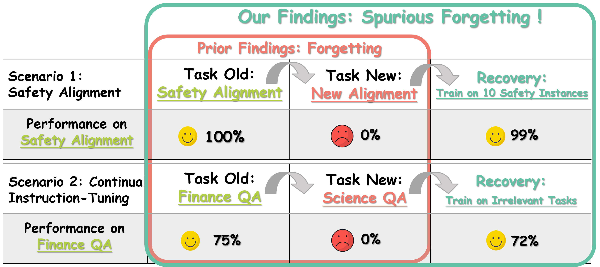

# 📢 [ICLR 2025] Spurious Forgetting in Continual Learning of Language Models

[](https://openreview.net/forum?id=ScI7IlKGdI)

Welcome to the repository accompanying our research on **Spurious Forgetting in Continual Learning of Language Models**, accepted at ICLR 2025. This repository is organized into two main sections, each dedicated to specific experiments and use cases.



---

## **📊 1. Experiments on the Biography Dataset**

### 📜 Overview
This section focuses on experiments using the synthetic **Biography Dataset**, designed to simulate a controlled continual learning environment. 

### 📂 Directory: `code_for_biography_dataset`

#### **🛠️ Key Features**
- **Dataset Preparation**: Generate the Biography dataset by running the preprocessing script:
  ```bash
  ./code_for_biography_dataset/physics_of_forgetting/data_preparation/preprocess_0720.py
  ```

#### **🔢 Experiments**
1. **Pretraining**:
   - Train a model on 100K individuals to establish a foundational knowledge base.
2. **Continual Finetuning**:
   - Incrementally finetune the model on 20K individuals.
   - Extended Settings:
     - Include more tasks.
     - Vary the number of individuals.
     - Explore diverse task types.
3. **Recovery Experiments**:
   - Investigate the model’s ability to recover performance on previously seen tasks.

#### **🔍 Visualizations**
- **Feature Perspective**:
  - Analyze residual stream shifts in the visualization directory:
    ```bash
    ./code_for_biography_dataset/physics_of_forgetting/residual_stream_shift_analysis
    ```

---

## **📊 2. Experiments on Real-World Scenarios**

### 📜 Overview
This section extends the research to real-world scenarios, integrating methods and datasets that reflect practical continual learning challenges. 

### 📂 Directory: `code_for_realworld_scenarios`

#### **🛠️ Repository Details**
This section builds upon [this incremental learning repository](https://github.com/zzz47zzz/codebase-for-incremental-learning-with-llm). For detailed instructions on dataset preprocessing and usage, refer to the README within this directory:
```bash
./code_for_realworld_scenarios/README.md
```

#### **🔢 Experiments**
1. **Continual Finetuning on Biography Dataset**:
   - Methods: EWC, LAMOL, Task Vector, Gradient Projection, SEQ, REPLAY, Freeze.
2. **Safety Alignment**:
   - Methods: Freeze, SEQ.
3. **Continual Instruction Tuning**:
   - Methods: Freeze, SEQ.
4. **Continual Knowledge Editing**:
   - Methods: Freeze, SEQ.
5. **Instance Incremental Learning**:
   - Methods: Freeze, SEQ.

#### **🔍 Visualizations**
- **Task Vector**:
  - Explore tradeoffs using:
    ```bash
    ./code_for_realworld_scenarios/visualization-tradeoff
    ```
- **Continual Learning Methods**:
  - Visualize EWC, LAMOL, and Gradient Projection results:
    ```bash
    ./code_for_realworld_scenarios/visualization_continual_learning_methods
    ```
- **Weight Update Perspective**:
  - Examine orthogonal weight updates:
    ```bash
    ./code_for_realworld_scenarios/visualization-orthogonal-weight-update
    ```
- **Loss Landscape Perspective**:
  - Analyze the model’s loss landscape:
    ```bash
    ./code_for_realworld_scenarios/visualization-loss-landscape
    ```

---

### **📚 Cite Our Work**
If you find this repository useful, please consider citing our research:
```bibtex
@inproceedings{
    zheng2025spurious,
    title={Spurious Forgetting in Continual Learning of Language Models},
    author={Junhao Zheng and Xidi Cai and Shengjie Qiu and Qianli Ma∗},
    booktitle={The Thirteenth International Conference on Learning Representations},
    year={2025},
    url={https://openreview.net/forum?id=ScI7IlKGdI}
}
```

### **🚀 Star the Repository**
Help us grow by starring 🌟 this repository on GitHub! 💖

---

Thank you for your interest in our work. We look forward to your feedback and collaboration! ✨

If you have questions about this repository, please feel free to contact me at [this email](junhaozheng47@outlook.com).